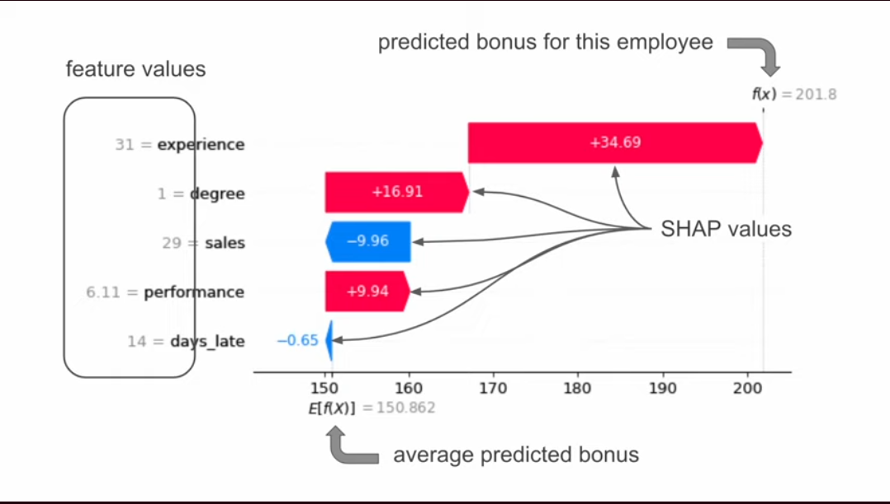

# Interpretability / Shap

# Introduction

Shap values are here to explain individuals models predictions. How each feature has contributed to the predictions and if features tend to increase or decrease the prediction made.

Feature importance does not do all this for a specific prediction.

We can also combine shape values from different predictions.
Image2.

Key benefits of Shap.
- Debugging and find which features causes the bug or anomalies.
- Human friendly explanations and increase trust in predictions.
- Data Exploration, and build better models with more appropriate features.


# Shap with Python

## Importing packages and prework

```python
import xgboost as xgb
import shap
shap.initjs(()

```


The example here is to predict the number of rings in avalons based on several features.
- Correlation matrix: We see that diameter and whole weight are highly correlated to a lot of the other variables so we drop those 2 variables.
- Sex is a categorical variable so we need to dummy it before using any ML model.

## Modeling

```python
# train
model = xgb.XGBRegressor(objective= 'reg:squarederror')
model.fit(X,y)


#Get predictions
y_pred = model.predict(X)

# Model Evaluation
plt.figure(figsize=())
plt.scatter(y,y_pred)
plt.plot([0,30],
  [0,30],
  color ='r'
  linestyle='-',
  linewidth =2)
plt.ylabel('Predicted')
plt.xlabel('Actual')
```

## Standard SHAP values

```python

# Get Shap values
explainer = shap.Explainer(model)
shap_values = explainer(X) # calculate the shap values for each observation values in the matrix X


np.shape(shap_values.values)
>>>(4100,8) # we have 8 features in the model so we have 8 shap values

```

Note: explainer(X) can be very time consumming. So instead of applying it to the whole X, we can apply it to a subset -> explainer(X[0:100])


## Waterfall plot

```python
# Waterfall plot for first observation
shap.plots.waterfall(shap_values[0])

shap.plots.waterfall(shap_values[0],max_display=4)
```
Image3


## Force Plot
You can see it as a condensed Waterfall plot.
Image4.

```python
shap.plots.force(shap_values[0])
```


**Waterfall and Force plots are useful to understand how the model has made individual predictions.**

## Stacked force plot
Combine multiple plots of multiple predictions.

```python
shap.plots.force(shap_values[0:100])
image5
```
Quickly explore some of the relationships capted by the model.

This is an **Interactive graph**

## Absolute Mean SHAP
To understand which features are important.
It is calculating the **absolute mean of all shap values for all observations**. So we can see which features has huge/significant contributions to the model prediction.
Image6

```python
shap.plots.bar(shap_values)
```

## Beeswarm plot

**THIS IS THE MOST USEFUL PLOT IN SHAP!!!**

```python
shap.plots.beeswars(shap_values)
```
image7


## Dependance Plots

```python
shap.plots.scatter(shap_values[:,"shell_weight"])

shap.plots.scatter(shap_values[:,"shell_weight"],
  color = shap_values[:, "shucked weight"])

shap.plots.scatter(shap_values(:,'shucked weight'])

```
Image 8-9


# Shapley Values for machine learning

TreeSHAP for decision trees or Random forest.

# Limitations of SHAP

SHAP is influenced by features correlations.
KERNSHAP assumed that features are independant. 

CANNOT be used for causal analysis.
**SHAP  is not a measure of how important a given feature is in the real world. it is simply how important a feature is to the model.**


# SHAP for Binary and multiclass Target variables

## Binary target

First we transform the target column (continous) into a binary one

```python
# binaryy target variable
y_bin = [1 if y_ >10 else 0 for y_ in y]

# train model
model_bin = xgb.XGBClassifier(objective = 'binary:logistic')
model.bin.fit(X,y_bin)

#get shap values
explainer = shhap.Explainer(model_bin)
shap_values_bin = explainer(X)
print(shap_values_bin.shape)


#waterfall plot for fiirst observation
shap.plots.waterfall(shap_values_bin[0])

shap.plot.waterfall(shap_values_bin[0],link='logit')

shap.plots.bar(shap_values_bin)

```
Image10
We are now dsealing with log odds.


## Multiclass Target Variables


```python
# binaryy target variable
y_cat = [2 if y_ >12 else 1 if y_ >8 else 0 for y_ in y]

# train model
model_cat = xgb.XGBClassifier(objective = 'binary:logistic')
model.cat.fit(X,y_cat)

# get probab predicitons
model_cat.predict_proba(X)[0]


#get shap values
explainer = shhap.Explainer(model_bin)
shap_values_bin = explainer(X)
print(np.shape(shap_values_bin.shape))
>>> (4177,8,3)


#waterfall plot for fiirst observation
shap.plots.waterfall(shap_values_cat[0,:,0])
shap.plots.waterfall(shap_values_cat[0,:,1])
shap.plots.waterfall(shap_values_cat[0,:,2])


```
Image11
We are now dsealing with log odds.


## Aggregatoing Shap values
We will focus on ly on shap values of the predicted classes.
```python
preds = model_cat.predict(X)
new_shap_values = []
for i, pred in enumerate(preds):
  new_shap_values.append(shapp_values_cat.values[i][:,pred])

#replace shap values
shap_values_cat.shape)
print(shap_values_cat.shape)
>>>(4177,8)


shap.plots.bar(shap_values_cat)
shap.plot.beeswarm(shap_values_cat)


```
Image11

# CatBoost Classifer for categorical features

Before remember we dummified the categorcial sex fetaure, so we obtained 1 shap valuues for each type of sex. The bad thing is wwe cannot interpret the global influence of the sex on the model prediction.

That is why we use CatBoost.
We can apply CatBoost on each categorical feature without oneHot encoding them..

```python
from catboost imnport CatBoostClassifier
import xgboost as xgb
import shap

from sklearn.metrics import accuracy_score, confusion_matrix


data = pd.read_csv...

y = data['class']
y =y.astype('category').cat.codes
X =data.drop('class',axis=1)
```

We can see the datframe has a lot of categorical features.
 
```python

# Create dummy variables for the categorical features
X_dummy = pd.get_dummies(X)
model = xgb.XGBClassifier()
model.fit(X_dummy, y)

explainer = shap.Explainer(model)
shap_values =explainer(X_dummy)
shap.plots.waterfall(shap_values[0])

```
image 12
we cannot relaly see what is the influence of odor, because we have odor_p, odor_n...and maybe other odor in the 108 features hidden ones.


So we use catboost to solve this problem.

```python
model = CatBoosClassifier(iterations =20, learning_rate =0.01, depth =3)

#train model
cat_features = list(range(len(X.columns)))
model.fit(X,y, cat_features)
# Get Shap values
explainer =shap.Explainer(model)
shap_values = explainer(X)

#Display shap values for first observation
shap.plots.waterfall(shap_values[0])

```

# Anomalies detection explained with Shap

Anomalies are data not following the same trend as the other instances.

## Isolation Forest

The closest the node with 1 is to the root node, the most likely this instance is an anonaly, becasue it ws super easy to separate it from the rest of the intances.
imagge 13


Anomaly score calculate the avreage of the path length of an instance.

Shorter path length suggest that instance is an anomaly.


## COde exmaple

```python
import shap
from sklearn.ensemble import IsolationForest
from ucimlrepo import fetch_ucirepo

power_consumption = fetch_ucirepo(id=235)
print(power-consumption.variables)


```

- Train Isolation Forest
  ```python
  #Parameters
  n_estimators = 100 # NUmber of Trees
  sample_size = 256 # NUmber of sample to train each tree
  contamination = 0.02 # Expeceted proportion of anomalies

  # Selectr Features

  features = data_aggregated.drop('Date', axis=1)

  # Train

  iso_forest = IsolationForest (n_estimators = n_estimators,
      contamination= contamination,
  max_samples =sample_size,
  random_state =42)

  iso_forest.fit(features)
  
